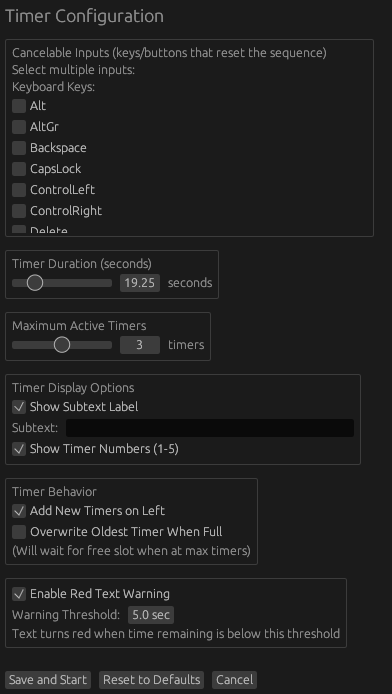
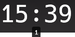
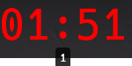

# Valorant Smoke Timer

[](https://github.com/dreadvisage/val_smoke_timer/actions/workflows/rust.yml)
[](https://opensource.org/licenses/MIT)
[](https://www.rust-lang.org/)

A customizable overlay countdown timer application with keyboard/mouse activation sequences.


## Purpose

I built this overlay application specifically with Valorant in mind. I play controllers in Valorant and I wanted a timer for my smokes to know when they'll expire. By default, it's configured for Brimstone and uses the default Valorant keybindings. While I've used this overlay extensively without being banned, that doesn't mean that it can't happen to you. Use at your own risk.

## Notes

In order for the overlay to work properly, you'll have to set your game to use "Windowed Fullscreen" instead of just "Fullscreen". Fullscreen will prevent the overlay from showing up properly.

Also, the timer is currently designed with the idea that it'll be placed in the upper left corner of the screen. While it can be placed elsewhere, it lacks full support for more unique placements.

## Showcase



Normal Timer           |  Red Timer
:-------------------------:|:-------------------------:
  |  
## Features

- **Two-Step Activation**: Start timers using a configurable two-step key/button sequence (e.g., press E, then right-click)
- **Cancelable Sequences**: Define keys/buttons that reset the activation sequence
- **Multiple Timers**: Run 1-5 simultaneous countdown timers
- **Transparent Overlay**: Always-on-top window with transparent background
- **Flexible Input**: Support for both keyboard keys and mouse buttons
- **Customizable Display**: Optional subtext labels and timer numbering

## Building From Source

```bash
# Clone the Repository
git clone https://github.com/dreadvisage/val_smoke_timer

# Release Build
cargo build --release
```

The built executable will be at `target/release/val_smoke_timer` or `target/release/val_smoke_timer.exe` depending on your platform.

## Usage

### General Overview

1. Launching the application first opens the config window
2. Configure settings
3. Click "Save and Start" to save the config and start the overlay
4. From this point on, the program is listening to your configured key/mouse presses
5. To close the overlay, you'll have to right-click and click exit on the taskbar icon. Otherwise, "Task Manager" is always a final resort.

### Running Timers

Once configured, the transparent timer overlay appears:
- Press your **start key/button** (e.g., E)
- Press your **confirm key/button** (e.g., right mouse button)
- A new timer starts counting down
- Pressing any **cancelable key** between start and confirm resets the sequence
- Pressing the **confirm key/button** will also reset the sequence alongside starting a timer
- Timers automatically disappear when they reach zero

## Requirements

- Supported operating systems:
    - Windows
    - macOS (compiles but the overlay may fail to run)
    - Linux (X11 only)

- The application may require permissions to listen to global keyboard/mouse events

- Unix builds may require setting execute permissions on the downloaded executable before using:
    - e.g., `sudo chmod +x val_smoke_timer`

- macOS caveats:
    - While the program compiles for macOS, when running the actual overlay when monitoring keyboard key presses, I've been getting the "Illegal Instruction" error. This issue doesn't occur with mouse presses. It may not be able to fully run on macOS without specific hardware configurations or compile flags. For example, the actual overlay will still show up if you set the two-key combination to left-click and right-click, but any keypress will cause the program to crash.

    - macOS may require that you allow running this program as an unsigned app

    - macOS requires that the process be granted access to the Accessibility API (i.e. val_smoke_timer needs to be added in System Preferences > Security & Privacy > Privacy) If the process is not granted access to the Accessibility API, macOS will ignore the global keyboard/mouse monitoring.

## Disclaimer

This application uses global input event listeners that may be detected by anti-cheat systems in online games. Using this software while playing online games may result in:
- Account suspension or permanent ban
- Loss of access to purchased content
- Violation of terms of service

While I've used this overlay extensively without any issues, that doesn't mean that it can't happen to you. Users are solely responsible for ensuring their use complies with all applicable terms of service, end-user license agreements, and game rules.

If you choose to use this application with any game, you do so entirely at your own risk.

## Antivirus Warning

This application monitors global keyboard and mouse input, which may cause antivirus software to flag it as malware or a keylogger. This is a false positive - the application only uses input monitoring to detect the configured activation sequences and does not log, record, or transmit any data. However, you may need to:
- Add an exception in your antivirus software
- Whitelist the executable
- Build from source yourself to verify the code's legitimacy

## Known Issues / Limitations

- While the program builds for macOS, when running the actual overlay when monitoring keyboard key presses, I've been getting the "Illegal Instruction" error. This issue doesn't occur with mouse presses. It may not be able to fully run on macOS without specific hardware configurations or compile flags. For example, the actual overlay will still show up if you set the two-key combination to left-click and right-click, but any keypress will cause the program to crash.

- The program will not work properly under Wayland in Linux or in the Linux kernel virtual console. The global keyboard/mouse monitoring uses X11 APIs which won't work in Wayland

- Trackpad click zones aren't always properly differentiated. A lot of times, trackpad clicks are just registered as a left-click no matter where you actually clicked

## Dev Notes 

- While I've tried implementing a tray icon for the overlay instead of having the taskbar icon, I ran into some issues that I couldn't be bothered to solve. Additionally, by keeping the taskbar approach, it makes the overlay more cross-platform, so that's a small plus

- While I could investigate macOS compatability issues further, I don't really deem it worthy because I designed the program for Valorant, which only runs on Windows anyway

- While this tool could be more comprehensive and feature-packed, I figured it was good enough to be useful and I'm more or less leaving it here

## License

This project is licensed under the MIT License - see the [LICENSE](LICENSE) file for details.
